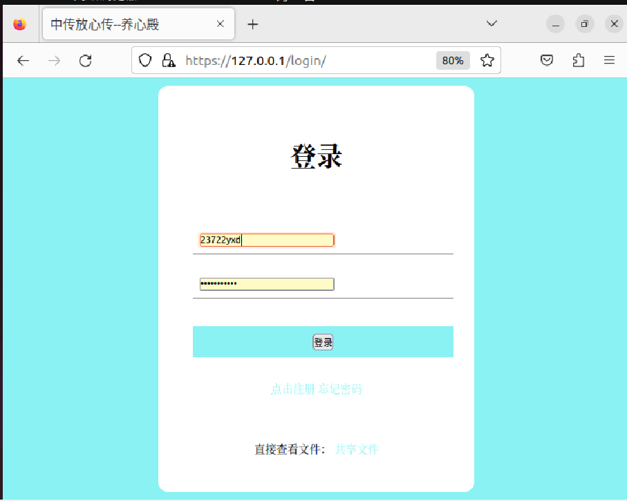
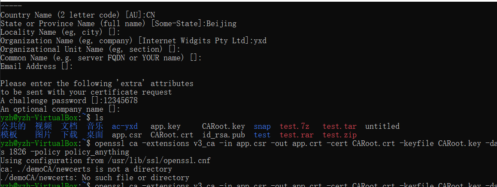
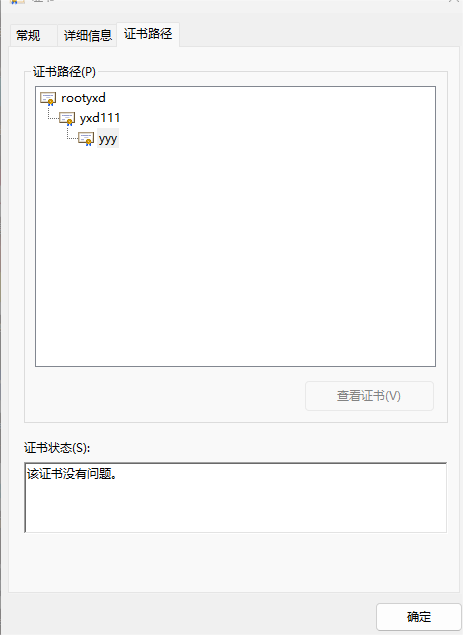

# 中传放心传个人实验报告

## 主要贡献

- 主要负责基于网页的用户注册与登录系统部分

- 完成网站前端样式的改进设计与制作

- 完成实现允许用户注册到系统，对用户名及用户口令进行条件限制

- 参与学习使用openssl自签发三级证书链

- 参与学习在容器中查看数据库，用户口令存储加盐的方法

- 完成根目录README文件撰写


## 完成工作与解决的问题

### 1. docker和docker-compose的安装

- 安装和验证过程参考了：[官方文档](https://docs.docker.com/engine/install/ubuntu/) 和 [容器与云|如何在 Ubuntu 22.04 LTS 中安装 Docker 和 Docker Compose](https://linux.cn/article-14871-1.html)

- 在验证时输入 `docker version` 曾遇到过下面的报错：

> docker: Got permission denied while trying to connect to the Docker daemon socket at unix

参考[这篇博客](https://blog.csdn.net/qq_45097352/article/details/116105246)，了解到需要将当前用户添加到docker用户组中

```
sudo groupadd docker               #添加用户组
sudo gpasswd -a yzh docker    #将当前用户添加至用户组
newgrp docker                      #更新用户组
```

- 运行

```
docker compose up -d --build
docker start ac_flask
docker ps
```

### 2. 配置域名

- 修改 `hosts` 文件，添加127.0.0.1 yxd.cuc.pan的映射

- 文件路径：

    - Windows环境中，文件位于C:\Windows\System32\drivers\etc

    - Ubuntu环境中，文件位于/etc/hosts

### 3. 用户名密码的设置条件

- 沿用了原文件中采用正则表达式进行条件限制的方式，对长度和合法字符按要求进行修改

```py
#用户名要求：可包含中英文、数字、合法字符，长度限制2-36字符
username_pattern = re.compile(r'[\u4e00-\u9fa5a-zA-Z0-9]{2,36}$')

#密码要求:必须包含大小写、数字，长度限制8-36字符
password_pattern = re.compile(r'(?=.*[a-z])(?=.*[A-Z])(?=.*\d)[\s\S]{8,36}')

```

### 4. 修改不合法用户名或密码的报错设置

- 经过测试，发现原有的错误提示不是很人性化，需要进一步细致划分，于是除了在页面上加上相应的要求提示之外，进行如下修改：

```py
    form = RegisterForm()
    #assert form.validate_on_submit(), 'invalid form fields'
    username = form.username.data
    assert username_pattern.fullmatch(username), '用户名不合法！'
    password = form.password.data
    confirm_password = form.confirm_password.data
    assert password != confirm_password, '两次输入密码不一致！'
    assert password_pattern.fullmatch(password), '密码不合法！'
```

### 4. 前端页面设计

- 原有页面仅由html文件构成，为了实现美观性，更好的与用户进行交互，补充了css样式设计，用 `link` 的形式引入到html中，更改后的登陆页面如下：



### 5. 完善网站证书的三级结构

- 为了保证安全，需要配置三级证书结构，小组的同学发现自己所做配置的第二级证书无法再向下颁发证书了，于是接手过来解决此问题并实现三级证书链

- 经过资料搜索与尝试，在生成中级证书的命令中应添加 `-extensions v3_ca` 的选项，从而赋予被签发的证书继续签发下级证书的权力

- 总结使用 `Openssl` 生成证书的注意事项如下：

    - 三次生成证书请求时的 `DN字段` ，即证书的识别名信息字段，除 `CN字段` ，即证书持有者的通用名外，需要全部 **保证一致**
    
    - `CN字段` 需要设置 **不同** 的三个名字，保证唯一性

    - 在填写 `DN字段` 时，如证书持有者所在城市、部门、邮箱等可省略不填，直接回车即可

    - 生成证书的命令时需要填写 **绝对路径** ，否则会出现如下报错：

    
     
    正确的写法：

    ```  
    openssl ca -extensions v3_ca -in /home/yzh/app.csr -out /home/yzh/app.crt -cert CARoot.crt -keyfile CARoot.key -days 1826 -policy policy_anythin
    ```

- 最终生成的文件：

    - .key :私钥

    - .csr :证书请求文件

    - .crt :证书文件

- 经过证书添加至本地信任，可以观察到成功呈现出三级结构



成功达到要求！

## 小总结

经过无数个崩溃的白天黑夜，总算是完成了。还记得当初刚拿到作业的时候大脑一片空白，看着满满当当的要求却无从下手，有两三天的时间都在读代码，听老师的课程资料。虽然还有别的事情，但脑子一闲下来就会开始想着这个作业。经过小组的讨论我们决定采用在前人的肩膀上继续完善的形式，其实本来想着这样可以减少一部分代码编写量，然而困难的部分其实是读代码，理解当前代码的架构，这是一切的基础，后续对照要求实现功能的部分需要额外学习的知识量是同样的。两周之中，已经想不起来开了多少个腾讯会议，有的时候就一直这么开一天，吃饭的时候就离开，吃完饭继续讨论，大家理解了哪一部分或者解决了什么问题都会在群里互相分享，我觉得这是两年以来第一次感受到合作的力量，也是一个机会发现伙伴们身上的闪光点。总而来说，过程是真的很痛苦，时间也总是觉得不够用，但也是真的充分利用了两周的时间尽我们最大的努力完成了！学会了太多太多，收获很大。

## 参考资料

- [(47条消息) url链接（url_for）与加载静态文件（static文件夹下的js、css、image）_qq_39974381的博客-CSDN博客](https://blog.csdn.net/qq_39974381/article/details/80841140)

- [使用OpenSSL工具制作X.509证书的方法](https://blog.csdn.net/howeverpf/article/details/21622545#t2)

- [在容器中查看数据库](https://zhuanlan.zhihu.com/p/259986189#:~:text=%E8%BF%9B%E5%85%A5%E5%AE%B9%E5%99%A8%20docker%20exec%20-it%20%7Bimage%7D%20bash,3.%E8%BE%93%E5%85%A5MySQL%E8%B4%A6%E5%8F%B7%E5%92%8C%E5%AF%86%E7%A0%81%E8%BF%9B%E8%A1%8C%E7%99%BB%E5%BD%95.%20mysql%20-u%20root%20-p%20%7Bpasswor%7D%204.%E6%98%BE%E7%A4%BA%E6%89%80%E6%9C%89%E7%9A%84%E6%95%B0%E6%8D%AE%E5%BA%93.)

- [如何安装浏览器根证书 - 简书](https://www.jianshu.com/p/e54073b3e0f8)