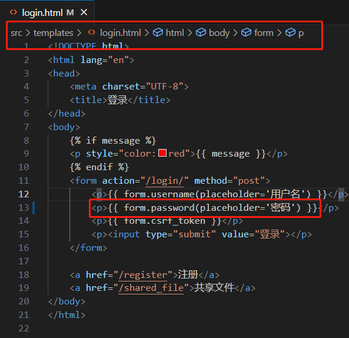
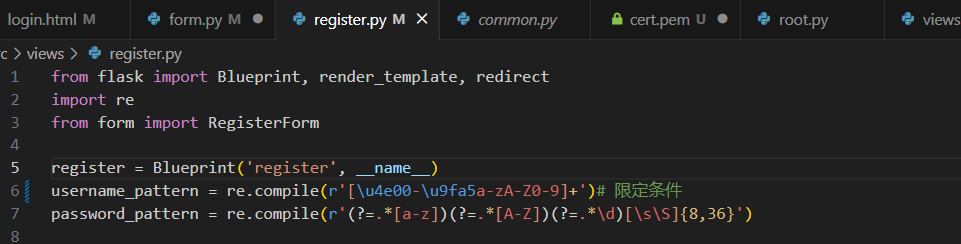

# 实验报告-中传放心传  
- 服务器系统版本：Ubuntu 22.04
## 实验分工
基于网页的用户注册与登录系统  
## 实验过程

### 安装WindowsDockerDesktop  
首先在官网下载DockerDesktop for Windows
```
wsl --install#根据官方文档，只有Win10 2004以上或win11才能使用这个命令
```
根据提示安装Ubuntu22.04即可  
### 克隆仓库并创建容器运行代码  
```
git clone https://github.com/c4pr1c3/ac.git
```
下载完毕后进入目的文件夹，使用Docker下载依赖
```
docker compose up -d --build
docker start ac_flask  
docker ps
```
运行结果如图：
  
可以看到开放127.0.0.1，宿主机访问`https://127.0.0.1`出现以下页面(被我添加了一个placeholder，可以在用户输入密码时获得提示)  
  
### VSCode远程连接Ubuntu
由于换了电脑，而Docker无法便捷操作文件，于是需要重新配置ssh远程连接，使用vscode方便地编辑文件，并在网页刷新后可以及时显示更改的效果。下面是远程连接以及html修改的部分  
   

### 完成第要求1：使用https绑定证书到域名而非IP地址 【 PKI X.509 】   
- 自签发CA：  
首先下载安装OpenSSL，添加环境变量，检查版本  
  
安装成功  
根据签发证书的原理，分为以下步骤：  
- 第一步：制作CA证书  
  - 生成CA私钥
    ```
    openssl genrsa -out ca.key 2048
    ```
  - 生成ca.crt（CA根证书（公钥）），填入证书的相关信息
    ```
    openssl req -new -x509 -days 7305 -key ca.key -out ca.crt
    ```
    
    产生了两个文件：  
    
- 第二步：制作网站的证书并用CA签名认证  
  - 生成winddweller.com证书私钥：  
    ```
    openssl genrsa  -out winddweller.com.pem 1024
    ```
  - 制作解密后的winddweller.com证书私钥：
    ```
    openssl rsa -in winddweller.com.pem -out winddweller.com.key
    ```
  - 生成签名请求：
    ```
    openssl req -new -key winddweller.com.pem -out winddweller.com.csr
    ```
      
  - 用CA进行签名  
    ```
    openssl ca -policy policy_anything -days 1460 -cert ca.crt -keyfile ca.key -in C:\Users\15822\Documents\SelfSigned_Certificate\windderller.com.csr -out winddweller.com.crt
    ```
到这一步，网站的私钥和证书就准备完毕了。获得了这些文件：  
- ca.key CA私钥
- ca.crt CA根证书
- winddweller.com.pem 网站私钥
- winddweller.com.key 解密后的网站私钥
- winddweller.com.csr 签名请求文件
- winddweller.com.crt 网站证书

当我将crt和key文件嵌入代码后  
```
ssl_context = (os.environ.get("SSL_PUB", default='winddweller.com.crt'), os.environ.get("SSL_PRIV", default='winddweller.com.key'))
```
却发现停止响应。经过资料查询和故障排查，包括修改docker设置的环境变量，都没有改变。最后，我尝试重新配置Docker，将新的环境变量更新到容器，签发者终于从ac-flask-demo.me，变成了我设置的root！！！（卡了好久阿！）  
  
然后，用它又生成了四个winddweller2文件作为下一级的证书。再配置上去：  
  
### 完成要求2：允许用户注册到系统  
- 用户名的合法字符集范围：中文、英文字母、数字  
- 类似：-、_、.等合法字符集范围之外的字符不允许使用  

根据实验要求，根据蓝图定位到Register.py，找到限定条件部分：  
   
可以看到，这部分对用户名与密码的格式做了限制。  
修改用户名正则表达式为：  
```
username_pattern = re.compile(r'[\u4e00-\u9fa5a-zA-Z0-9-_ ]+')
```
### 进行测试：  
先输入！！！作为用户名  
  
显示了不合法用户名  

输入_Wind dweller-作为用户名，其中-、空格和_均为允许的字符。设置密码为123456：  
  
显示了无效密码。由于密码规则的判断在用户名之后，可知用户名通过了检测。  

代码已经完成了以下要求：  
- 用户口令长度限制在36个字符之内
- 对用户输入的口令进行强度校验，禁止使用弱口令  

密码正则表达式为：
```
password_pattern = re.compile(r'(?=.*[a-z])(?=.*[A-Z])(?=.*\d)[\s\S]{8,36}')
```  
意为：
- (?=.*[a-z])：至少包含一个小写字母
- (?=.*[A-Z])：至少包含一个大写字母
- (?=.*\d)：至少包含一个数字
- [\s\S]{8,36}：长度位于8-36之间  
但是，源代码并没有对密码做不能输入非法字符的要求，因此更改为：
```
password_pattern = re.compile(r'(?=.*[a-z])(?=.*[A-Z])(?=.*\d)[\u4e00-\u9fa5a-zA-Z0-9-_ \s\S]{8,36}')S
```
再次进行测试  
在原来的密码基础上输入！￥#，显示以下提示  
  
成功，注册的规则设置完毕
### 完成要求3：使用合法用户名和口令登录系统  
和上一个要求同理，我们需要在登录页面使用正则表达式，禁止用户输入非法内容  
修改login.py，对它添加：  
```
username_pattern = re.compile(r'[\u4e00-\u9fa5a-zA-Z0-9-_ ]+')
password_pattern = re.compile(r'[\u4e00-\u9fa5a-zA-Z0-9-_ ]+')
```
因为要防止有人进行注入攻击等，因此password的正则表达式应该与username相同。
```
    assert username_pattern.fullmatch(username), 'invalid username'
    assert password_pattern.fullmatch(password), 'invalid password'
```
添加导入参数的代码：  
```
username = form.username.data
password = form.password.data
```
### 测试  
在username输入非法字符！！！，显示：  
  
输入正确的用户名，然后在正常的密码后添加！！！，显示：  
  
成功，登录规则设置完毕

### 观察源代码对下面两个要求的实现
- 禁止使用明文存储用户口令 【 PBKDF2 散列算法 慢速散列 针对散列算法（如MD5、SHA1等）的攻击方法 】
- 存储的口令即使被公开，也无法还原/解码出原始明文口令
通过观察代码，在register.py中发现了以下两行：  
```
hash_password = form.get_hash_password()
User.create_user(username, hash_password)
```
查找form.py，发现以下功能：  
```
class PasswordForm(FlaskForm):
    password = PasswordField('password', validators=[DataRequired()])

    def get_hash_password(self):
        from hashlib import sha512
        return sha512(self.password.data.encode()).digest()
```
查找user.py，发现以下功能：  
```
@classmethod
def create_user(cls, username, hash_password):
    import secret
    user = User.get_by(username=username)
    assert user is None, 'email already registered'
    # 先随机生成一个用户的对称密钥与公私钥
    symmetric_key = secret.new_symmetric_key()
    private_key, public_key = secret.new_pair()
    # 再用服务器的公钥加密这些密钥
    user = User(username=username, hash_password=hash_password,
                encrypted_symmetric_key=secret.encrypt(symmetric_key),
                encrypted_private_key=secret.encrypt(private_key),
                encrypted_public_key=secret.encrypt(public_key)
                )
    db.session.add(user)
    db.session.commit()
```  
可知，此模块首先判断用户名是否重复，然后生成了用户的对称密钥与公私钥，并用服务器公钥加密了密钥。最终将user中的全部内容（username，被hash加密的密码，对称密钥与公私钥）存入数据库。哈希算法使用的是SHA512。

## 实验收获
- 学习了CA证书签发的流程  
- 学习了Flask框架  
- 学习了在Windows上使用Docker  
- 学习了正则表达式  
- 学习了数据加密存储原理  
- 学习了防御注入攻击的方法  
- 增加了读代码的时间和debug的能力：） 
- 锻炼了资料查找的能力  
## 遇到的问题与解决方法  
由于家里电脑没装虚拟机，于是打算直接在Windows上使用Docker功能。最开始搞错了运行的系统，直接在Windows系统里运行了Docker。。于是乎傻傻的卡了很久。
WindowsDocker实际的使用方法是：在Windows搜索并打开Linux22.04，打开命令行，克隆仓库后使用Docker命令。  
当代码出现bug时，服务器会自动关闭，需要重新启动  
在设置login的invalid username后，点击出现了报错  
  
将Login和Register代码进行对比后，发现是少加了两行：  
```
username = form.username.data
password = form.password.data
```
所以  
```
assert username_pattern.fullmatch(username), 'invalid username'
assert password_pattern.fullmatch(password), 'invalid password'
```
这两行代码里的参数没传进去。添加那两行就解决了这个问题。  
在进行CA对Server证书签名的阶段，openssl一直在报错Using configuration from C:\Program Files\Common Files\SSL/openssl.cnf Unable to load number from ./demoCA/serial D0F00000:error:06800096:asn1 encoding routines:a2i_ASN1_INTEGER:shortline:crypto\asn1\f_int.c:139:
error while loading serial number，按照网上的教程修改了n多遍，例如增加demoAC文件夹，加入index.txt,在serial中输入01的序列号，但是之后还是有问题，而修改方式大多数是在Linux系统上完成的，于是只好使用虚拟机新生成了以上内容。  
 非常sad，虚拟机里也失败了，也是一样的错误。转战老师给的python脚本了，虽然和仨小时说拜拜，但是依然学到了自签发的过程和签发的原理。  
`后来还是想修一修它，于是查找了很多资料，发现是serial文件是ANSI编码。转换编码后又出现了找不到文件的情况，输入了绝对路径，wow，成了！`

## 参考资料  
[利用ssh远程连接Linux](https://blog.csdn.net/cxn15335120506/article/details/123238233?ops_request_misc=%257B%2522request%255Fid%2522%253A%2522168977085016800185888720%2522%252C%2522scm%2522%253A%252220140713.130102334..%2522%257D&request_id=168977085016800185888720&biz_id=0&utm_medium=distribute.pc_search_result.none-task-blog-2~all~top_positive~default-1-123238233-null-null.142^v90^control_2,239^v2^insert_chatgpt&utm_term=vscode%E8%BF%9C%E7%A8%8B%E8%BF%9E%E6%8E%A5linux&spm=1018.2226.3001.4187)  
[Flask 表单form.validate_on_submit()什么情况下会是false，还有解决方法](https://blog.csdn.net/zyself/article/details/87828972)  
[Flask表单](http://www.bjhee.com/flask-ext7.html)  
[flask_wtf中的参数介绍（StringField，PasswordField...）](https://blog.csdn.net/zyself/article/details/85218323)   
[什么是SSL，HTTPS是如何工作的？](https://www.cnblogs.com/ehcoo/p/6368304.html#)  
[环境篇-Windows下安装OpenSSL](https://blog.csdn.net/zyhse/article/details/108186278)  
[自做CA自签发SSL证书](https://blog.csdn.net/zclovepp1314/article/details/77687917)
[2020年用openssl自做CA自签发SSL证书](https://blog.csdn.net/Kevin_lady/article/details/108749089)   
[os.environ模块环境变量详解](https://blog.csdn.net/happyjacob/article/details/109279118)