# "中传放心传“单人实验报告——ych

## 一、实验环境
### 虚拟机：Ubuntu 20.04
### 主机：Windows10
### 软件环境：VSCode、docker等


## 二、实验负责部分
### 基于网页的用户注册与登录系统
- [x] 禁止使用明文存储用户口令 【 PBKDF2 散列算法 慢速散列 针对散列算法（如MD5、SHA1等）的攻击方法 】
  - [x] 存储的口令即使被公开，也无法还原/解码出原始明文口令

## 三、实验环境配置
### Install Docker Engine on Ubuntu
- 运行以下命令以卸载所有冲突的软件包
```
for pkg in docker.io docker-doc docker-compose podman-docker containerd runc; do sudo apt-get remove $pkg; done
```
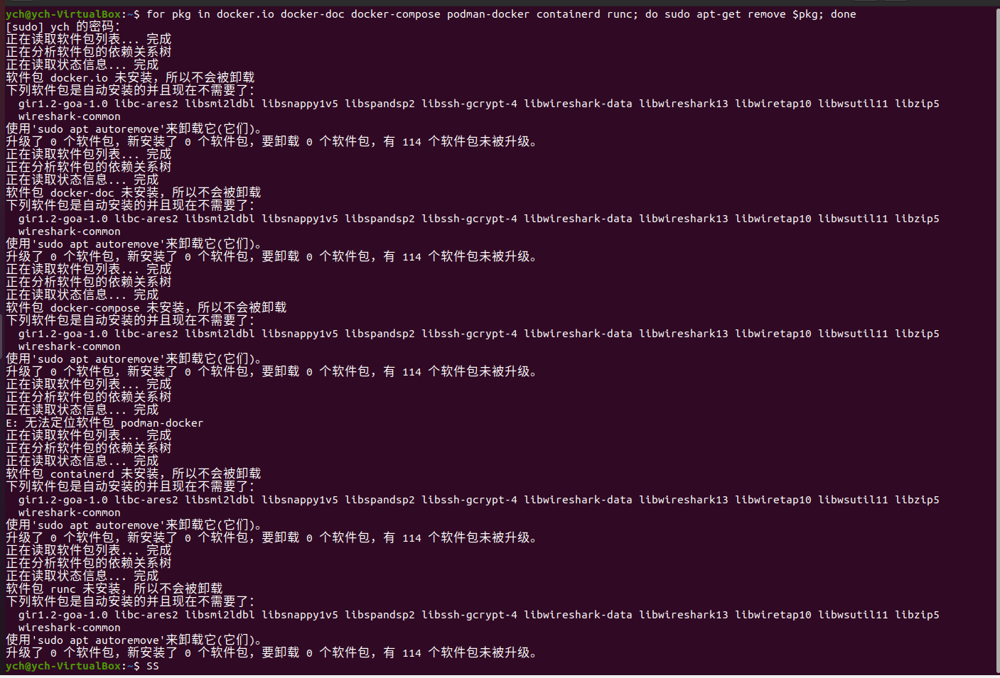    
- 更新软件包索引并安装软件包以允许使用基于HTTPS 的存储库
```
sudo apt-get update
sudo apt-get install ca-certificates curl gnupg
```
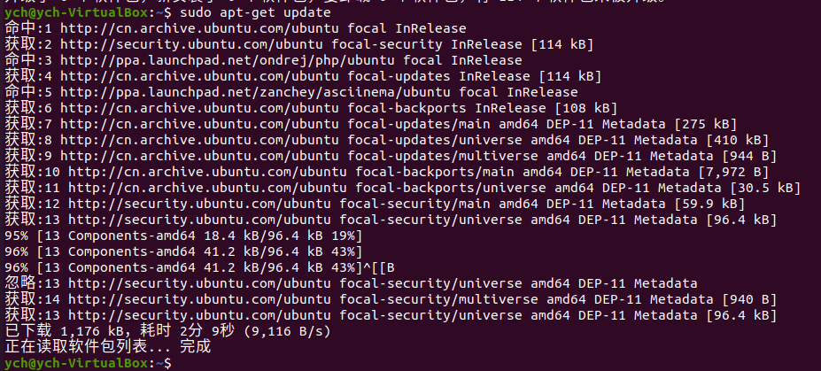    
- 添加 Docker 的官方 GPG 密钥
```
sudo install -m 0755 -d /etc/apt/keyrings
curl -fsSL https://download.docker.com/linux/ubuntu/gpg | sudo gpg --dearmor -o /etc/apt/keyrings/docker.gpg
sudo chmod a+r /etc/apt/keyrings/docker.gpg
```

- 使用以下命令设置存储库
```
echo \
"deb [arch="$(dpkg --print-architecture)" signed-by=/etc/apt/keyrings/docker.gpg] https://download.docker.com/linux/ubuntu \
"$(. /etc/os-release && echo "$VERSION_CODENAME")" stable" | \
sudo tee /etc/apt/sources.list.d/docker.list > /dev/null
```
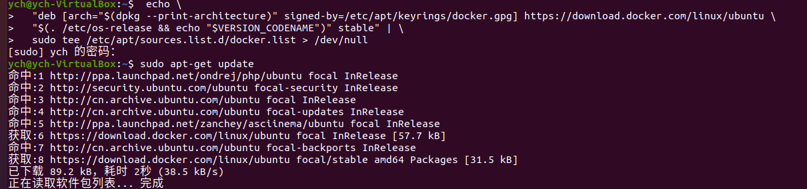    
- 安装 Docker 引擎
```
# 更新包索引
sudo apt-get update
# 安装 Docker Engine、containerd 和 Docker Compose
sudo apt-get install docker-ce docker-ce-cli containerd.io docker-buildx-plugin docker-compose-plugin
```
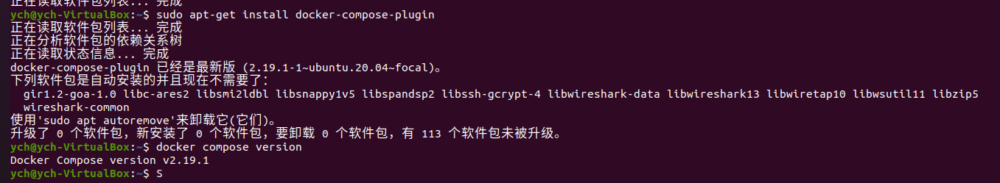     

### VSCode 里连接远程SSH主机，结果如下：
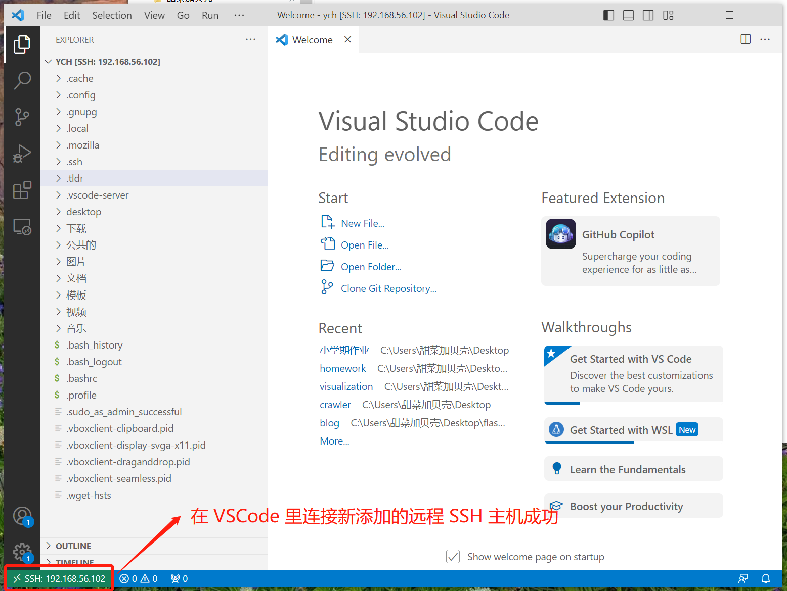     

## 四、测试已部分修改的示例代码
### 在VScode的终端中进入目的文件夹，使用Docker
```
# 切换成root用户操作
su root
# 构建启动并且后台运行一组服务
docker compose up -d --build
# 启动名为ac_flask的container
docker start ac_flask  
# 列出当前运行的所有container
docker ps
```
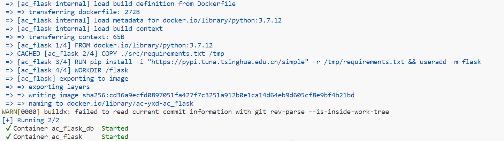    
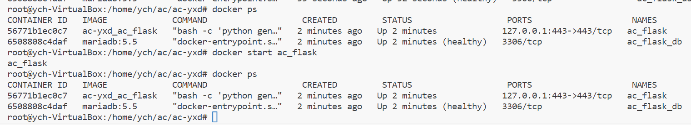    

### 利用虚拟机访问https://127.0.0.1
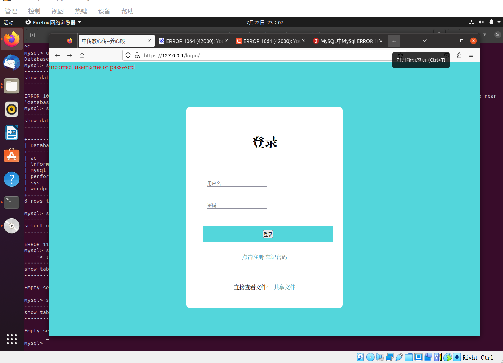    

## 五、完成实验任务
- [x] 禁止使用明文存储用户口令 【 PBKDF2 散列算法 慢速散列 针对散列算法（如MD5、SHA1等）的攻击方法 】
  - [x] 存储的口令即使被公开，也无法还原/解码出原始明文口令

### （一）代码实现
1. 在form.py中，定义了一个类PasswordForm，它继承自FlaskForm类，用来创建和验证一个密码表单。
```python
class PasswordForm(FlaskForm):
    password = PasswordField('password', validators=[DataRequired()])

    def get_hash_password(self):
        from hashlib import sha512
        #返回密码字段输入的字符串经过SHA-512哈希后的字节串（byte string）。
        return sha512(self.password.data.encode()).digest()
```

2. 在user.py中，定义一个User类，它是一个数据库模型，继承自db.Model。以达到用Python对象来操作数据库的目的，其中create_user是一个类方法，它接受两个参数：username和hash_password,用来创建一个新的用户。
```python
@classmethod
    def create_user(cls, username, hash_password):
        import secret
        user = User.get_by(username=username)
        assert user is None, 'email already registered'#该用户已经被注册过了
        # 先随机生成一个用户的对称密钥与公私钥
        symmetric_key = secret.new_symmetric_key()
        private_key, public_key = secret.new_pair()
        # 再用服务器的公钥加密这些密钥
        user = User(username=username, hash_password=hash_password,
                    encrypted_symmetric_key=secret.encrypt(symmetric_key),
                    encrypted_private_key=secret.encrypt(private_key),
                    encrypted_public_key=secret.encrypt(public_key)
                    )
        db.session.add(user)
        db.session.commit()#提交到数据库
```

3. 在register.py中定义一个视图函数post__register()，它用来处理用户的POST请求，并且返回一个响应。对其中的password进行**加盐**处理，用来避免彩虹表攻击。
```python
        # 生成一个 16 字节的随机字符串作为盐
        salt = str(os.urandom(16))
        # 将盐和密码拼接起来，并转换为字节序列
        password = salt + form.password.data
        
        hash_password = form.get_hash_password()
        # 调用User类的create_user方法，根据username和hash_password创建一个新的用户记录。
        User.create_user(username, hash_password)
```

4. 在login.py中定义一个视图函数post__login()，它用来处理用户的POST请求，并且返回一个响应。其中用到hash的部分为
```python
@login.route('/', methods=['POST'])
def post__login():
    from models import User, OnlineUser
    try:
        form = LoginForm()
        assert form.validate_on_submit(), 'invalid form fields'
        #调用form对象的get_hash_password方法，获取表单中输入的密码经过哈希（hash）后的值，并且赋值给hash_password变量。 
        hash_password = form.get_hash_password()
        username = form.username.data
        #调用User类的get_by方法，根据username和hash_password查询用户记录，并且赋值给user变量。
        user = User.get_by(username=username, hash_password=hash_password)
        assert user, 'incorrect username or password'
        token = OnlineUser.create_record(user.id_)
        return set_token(redirect('/'), token)
    except AssertionError as e:
        message = e.args[0] if len(e.args) else str(e)
        return render_template('login.html', form=LoginForm(), message=message)
```
### （二）测试效果
1. 注册一个用户并登录

2. 进入Docker容器下的MySQL数据库，进行操作并查看users表。
```
# 首先查看Linux环境下所有的docker容器.(目的是找到数据库容器镜像名称)
docker ps

# 进入容器
docker exec -it {image} bash

# 输入账号和密码进行登录.
mysql -u root -p{password}
```
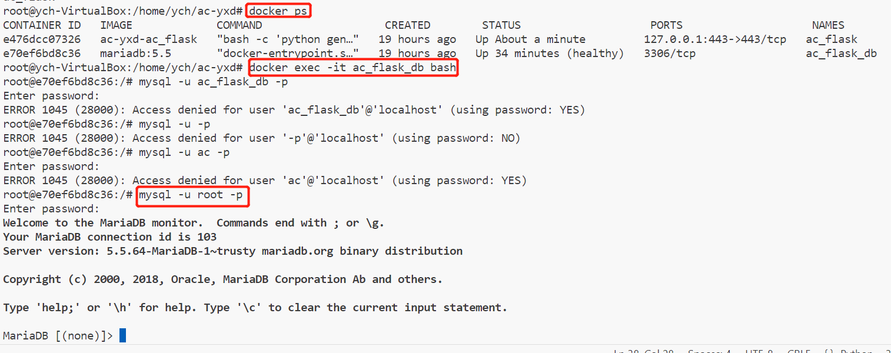     

```
# 显示所有的数据库.
show databases;

# 要进行SQL查询,需要指定使用某个数据库.
use {dbname};

# 查看目标数据库所有的表.
show tables;

# 执行SQL查询
select * from userinfo;
```
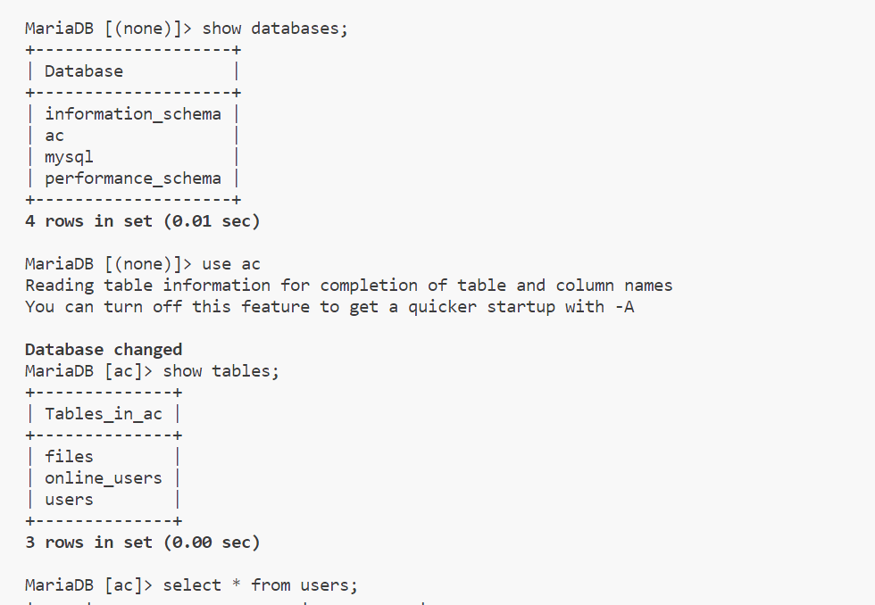    
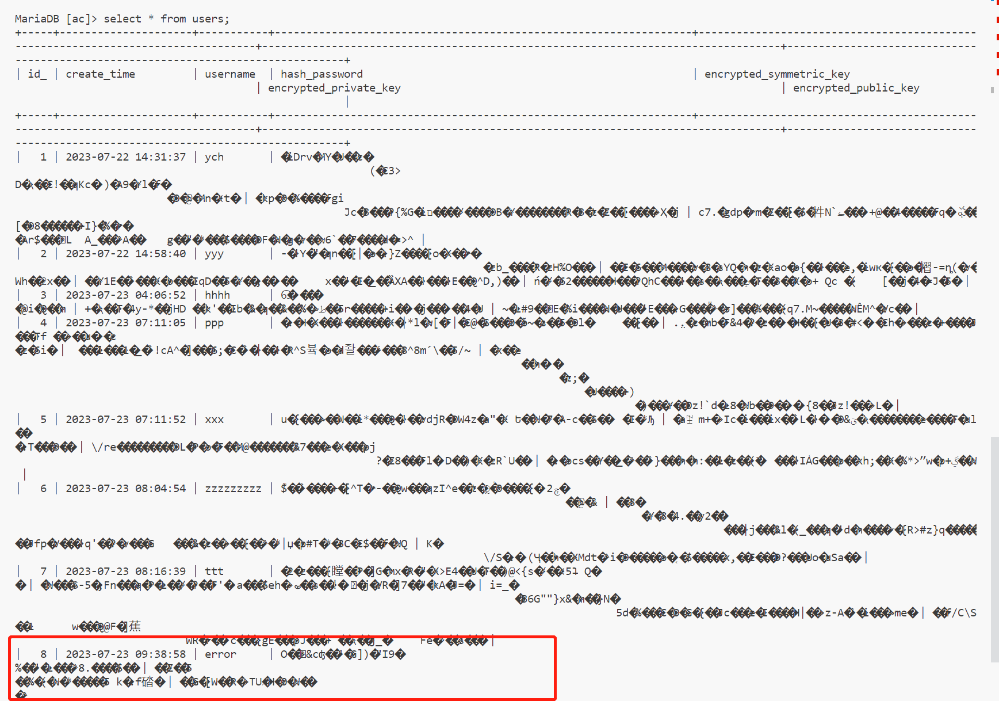    
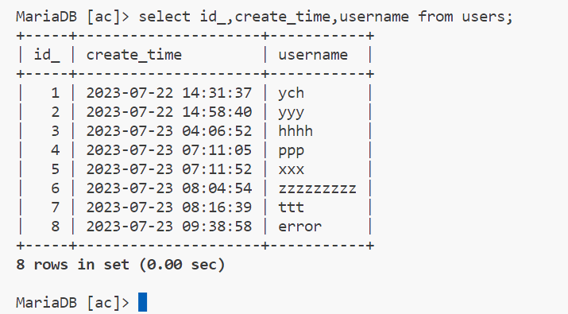    

## 六、实验收获
- 学习了docker环境的搭建
- 学习了hash函数的使用以及**加盐**
- 学习了docker环境中数据库的使用和查询

## 七、实验过程中遇到的问题以及解决方法   
### （一）Linux中docker报错：ERROR: Got permission denied while trying to connect to the Docker daemon socket。
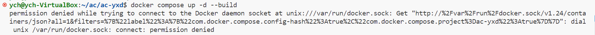    
- 这是由于当前用户的权限不够，所以被禁止启动docker。
- 切换成root用户操作，就可以使用了。
```
su root
```

### （二）pip._vendor.urllib3.exceptions.ReadTimeoutError: HTTPSConnectionPool(host='files.pythonhosted.org', port=443): Read timed out.
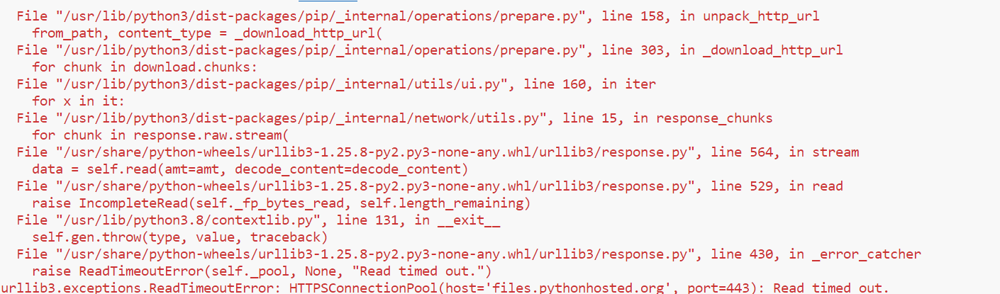    
- 这个问题是下载超时
- 解决方法：
```
pip --default-timeout=100 install [需要下载的包名]
```

## 八、参考资料  
- [Install Docker Engine on Ubuntu](https://docs.docker.com/engine/install/ubuntu/)     
- [Install the Compose plugin](https://docs.docker.com/compose/install/linux/#install-using-the-repository)     
- [linux中docker报错：ERROR: Got permission denied while trying to connect to the Docker daemon socket。](https://blog.csdn.net/qq_45097352/article/details/116105246)     
- [解决pip._vendor.urllib3.exceptions.ReadTimeoutError: HTTPSConnectionPool](https://blog.csdn.net/m0_47505062/article/details/128900267)    
- [(Linux环境)如何进入Docker容器下的MySQL数据库?并执行常规的一些SQL查询?](https://zhuanlan.zhihu.com/p/259986189#:~:text=%E8%BF%9B%E5%85%A5%E5%AE%B9%E5%99%A8%20docker%20exec%20-it%20%7Bimage%7D%20bash,3.%E8%BE%93%E5%85%A5MySQL%E8%B4%A6%E5%8F%B7%E5%92%8C%E5%AF%86%E7%A0%81%E8%BF%9B%E8%A1%8C%E7%99%BB%E5%BD%95.%20mysql%20-u%20root%20-p%20%7Bpasswor%7D%204.%E6%98%BE%E7%A4%BA%E6%89%80%E6%9C%89%E7%9A%84%E6%95%B0%E6%8D%AE%E5%BA%93.)    
- [用户密码加密存储十问十答](https://zhaox.github.io/security/2016/11/05/how-to-store-users-password-securely)     
