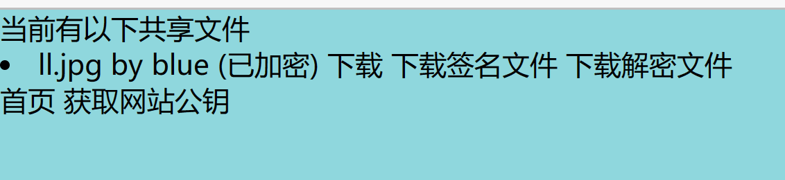
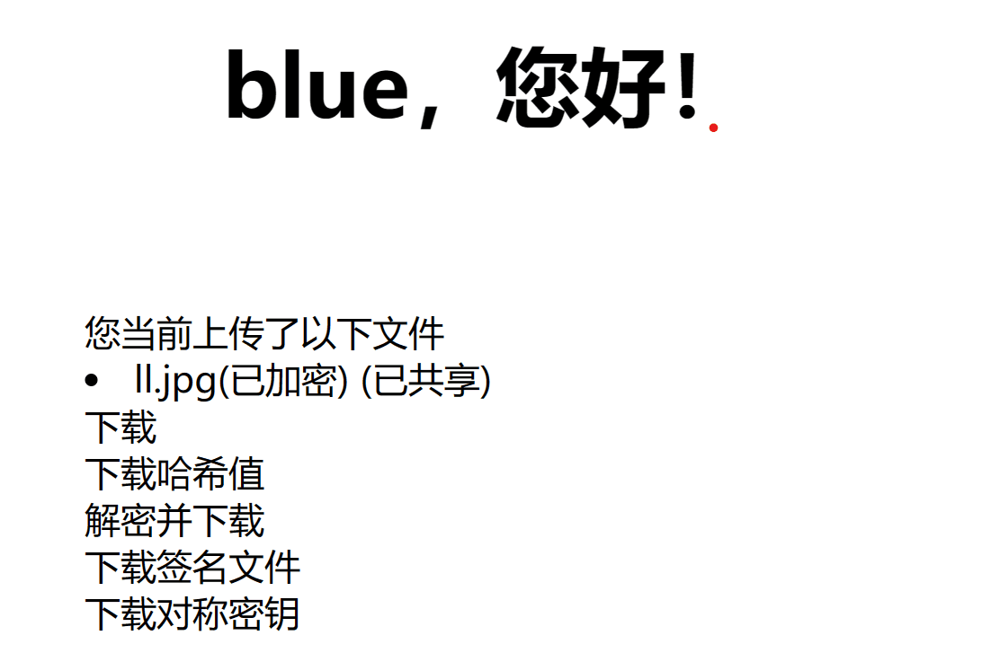
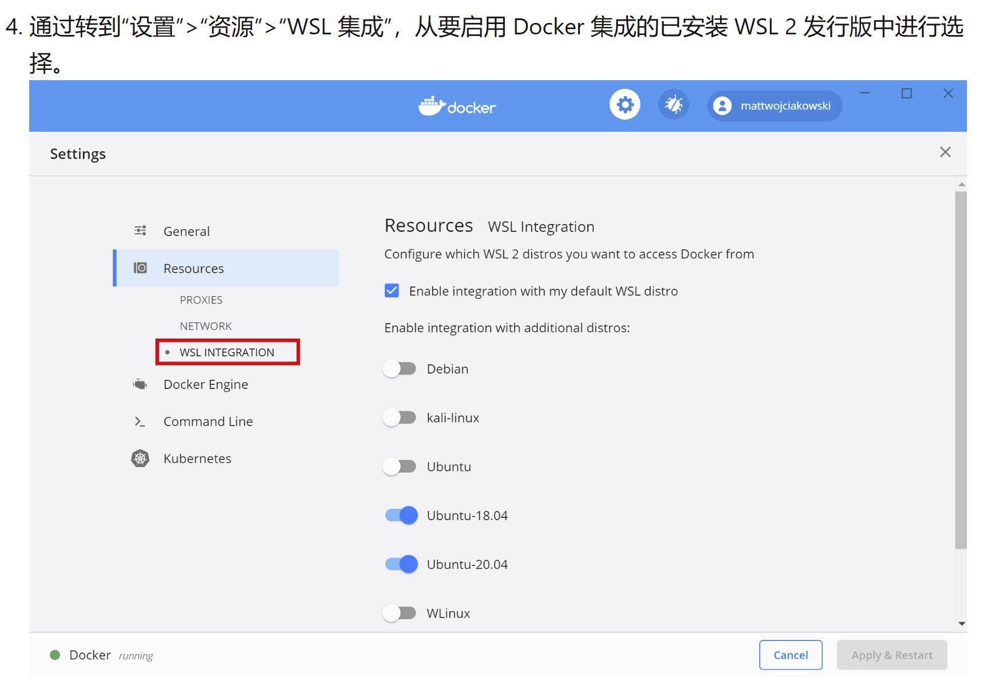

## 实验分工
基于网页的加密文件下载与解密
- [x] 提供匿名用户加密后文件和关联的数字签名文件的下载
    - 客户端对下载后的文件进行数字签名验证
    - 客户端对下载后的文件可以解密还原到原始文件
- [x] 提供已登录用户解密后文件下载
## 实验内容
- 提供匿名用户加密后文件和关联的数字签名文件的下载
    - 客户端对下载后的文件进行数字签名验证
     匿名用户查看共享文件夹，可择下载数字签名，并获取网站公钥，使用公钥验证数字签名。
     
    - 客户端对下载后的文件可以解密还原到原始文件
     匿名用户查看共享文件夹，可选择下载解密文件
     
     关键代码片段
      ```
      @shared_file.route('/download')
      def get__download():
      from models import User, File
      try:
        filename = request.args.get('filename')
        assert filename, 'missing filename'
        username = request.args.get('username')
        assert username, 'missing username'
        type_ = request.args.get('type')
        assert type_, 'missing type'
        assert type_ in ('encrypted', 'signature','plaintext'), 'unknown type'
        user = User.get_by(username=username)
        return File.download_file(user, filename, type_)
      except AssertionError as e:
        message = e.args[0] if len(e.args) else str(e)
        flash('下载失败！' + message)
        return redirect('/shared_file')
      ```
      ```
      <div class="container">当前有以下共享文件
        <div class="form-wrapper">
        <ui>
        
            <li>
                {{e[0]}} by {{e[1]}} (已加密)
                <a href="/shared_file/download?filename={{e[0]}}&username={{e[1]}}&type=encrypted">下载</a>
                <a href="/shared_file/download?filename={{e[0]}}&username={{e[1]}}&type=signature">下载签名文件</a>
                <a href="/shared_file/download?filename={{e[0]}}&username={{e[1]}}&type=plaintext">下载解密文件</a>
            </li>
        
        </ui>
      
      <div class="container">
        <div class="login-wrapper">
            <div class="header">当前没有共享文件</div>
        <!--<p>当前没有任何共享文件</p> -->
      
      <a href="/">首页</a>
      <a href="/public_key">获取网站公钥</a>
      </div>
      </div>
      </div>
      </div>
      </div>
      ```
  
- 提供已登录用户解密后文件下载
  已登录用户在上传文件后文件将以加密形式存储，用户可选择下载该加密后文件，或下载原文件，并获取签名文件以及对称密钥。
  
  关键代码片段：
  ```
  def get__download(user):
    try:
        filename = request.args.get('filename')
        assert filename, 'missing filename'
        type_ = request.args.get('type')
        assert type_, 'missing type'
        assert type_ in ('encrypted', 'plaintext', 'signature', 'hashvalue'), 'unknown type'
        return File.download_file(user, filename, type_)
    except AssertionError as e:
        message = e.args[0] if len(e.args) else str(e)
        flash('下载失败！'+message)
        return redirect('/file')
  ```
  ```
   def download_file(cls, user, filename, type_):
        from flask import make_response
        f = File.query.filter(and_(File.creator_id == user.id_, File.filename == filename)).first()
        assert f, 'no such file ({})'.format(filename)
        hash_value = f.hash_value
        if type_ == 'hashvalue':
            # 读取哈希值
            content = hash_value
            filename = filename + '.hash'
        elif type_ == 'signature':
            # 读取签名
            with open(storage_path+str(user.id_)+'/'+hash_value+'.sig', 'rb') as f_:
                content = f_.read()
                filename = filename+'.sig'
        else:
            with open(storage_path+str(user.id_)+'/'+hash_value, 'rb') as f_:
                content = f_.read()
            # 读取明文
            if type_ == 'plaintext':
                content = secret.symmetric_decrypt(secret.decrypt(user.encrypted_symmetric_key), content)
            # 读取密文
            elif type_ == 'encrypted':
                filename = filename + '.encrypted'
        response = make_response(content)
        response.headers['Content-Disposition'] = 'attachment; filename={}'.format(filename)
        return response

  ```

## 实验问题
- 输入命令`docker compose up -d --build`报错`docker:command not found`
  - 解决方法：通过搜索引擎寻找到：
   
- 关于匿名用户下载文件并解密的实现：
   - 网站采用共享文件方式使匿名用户获取加密文件，需向匿名用户提供对称密钥实现解密。本次实验选择在共享文件夹中添加下载解密后文件，以实现匿名用户下载解密文件。  
   - 虽说是实现了要求，但存在很严重的安全漏洞。这里提出解决思路：   
   - 已登录用户生成唯一验证码，并将验证码分享给信任客户端。获得验证码的客户端可不用登录，以匿名方式访问共享文件夹，输入获取的验证码提取该已登录用户所共享文件的解密文件，以此保证只有已登录用户的信任客户端才可以获取解密文件。  
   - 由于时间关系和本人能力有限，经过多次尝试仍然无法实现该功能。
## 实验收获
本次实验从安装、配置环境开始，到后续读懂代码、手动编写代码，几乎全都从零开始。从一开始的不知所措，到逐渐上手研究报错信息，判断报错原因，解决各种各样奇奇怪怪的错误，其中包括：docker命令无法运行；修改代码在前端却看不到变化，从而发现远程连接莫名其妙断掉，经过多种尝试、不断搜索解决方案，最终得以回归正轨。初看代码时一脸懵，于是再次学习安靖老师`flask 初探`，逐渐了解代码逻辑与结构，尝试修改代码并取得小小成功。
总体来说，此次实验的实现并不够完美，甚至可以说漏洞百出，对代码的理解也不能算得上是透彻。但于我而言，初次参加小组协作项目，与队友们或讨论、或开会互相帮助解决不同的大大小小的问题；不断遇到新的错误不断尝试解决；不断遇到理解不了的逻辑和看不懂的代码不断学习，深刻认识到官方文档的重要性并努力读懂官方文档，这都是我在这次小学期中很宝贵的收获。  

`
## 参考资料
[win11安装docker](https://blog.csdn.net/dzw0120/article/details/128749857)
[WSL2上的Docker远程容器入门](https://learn.microsoft.com/zh-cn/windows/wsl/tutorials/wsl-containers
)
[使用WSL在Windows上安装Linux](https://learn.microsoft.com/zh-cn/windows/wsl/install)
[Flask初探](http://courses.cuc.edu.cn/course/110094/learning-activity/full-screen#/555312)