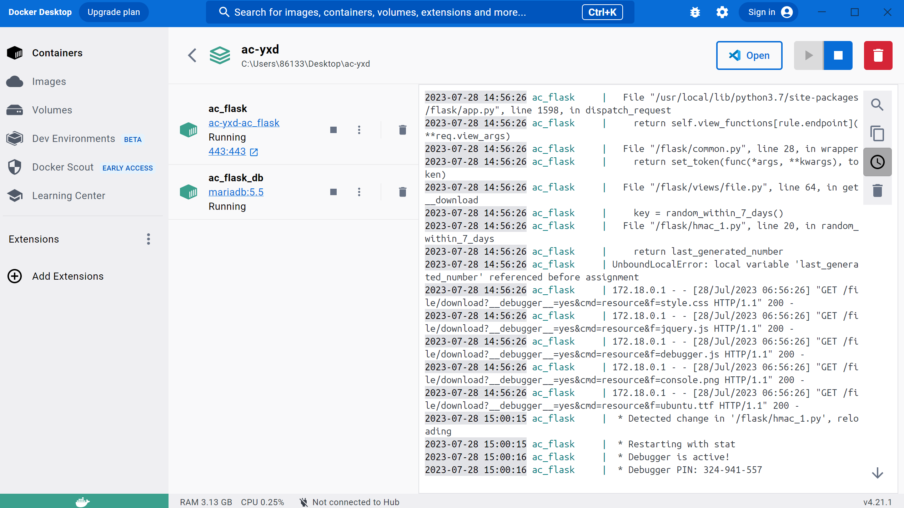
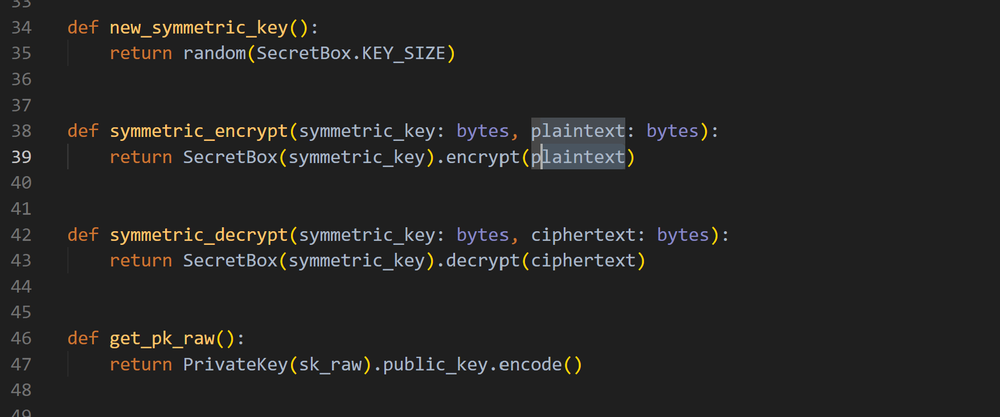
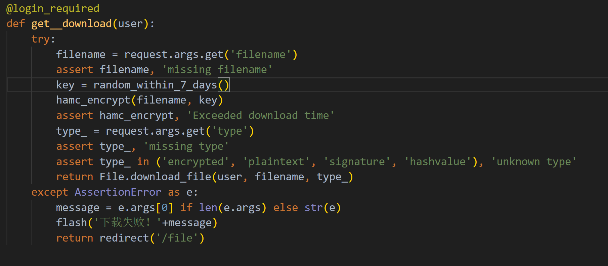
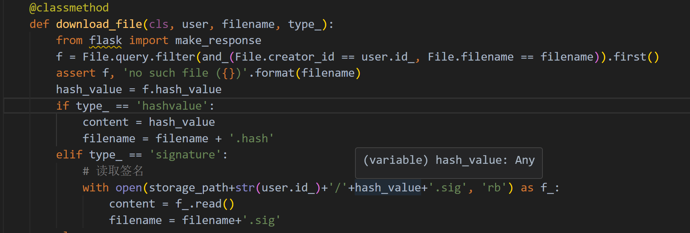

# 实验报告-中传放心传

## 实验分工

- 提供已登录用户解密后文件下载
- 下载URL设置有效期(限制时间或限制下载次数)，过期后禁止访问[数字签名消息认证码Hash Extension Length AttackHash算法与HMAC算法的区别与联系]
- 提供静态文件的散列值下载，供下载文件完成后本地校验文件完整性

## 实验过程

### 配置阶段

首先下载dockerdesktop，因为听说了同组其他成员将docker下载到虚拟机里面，导致电脑崩溃的恐怖故事之后，我决定将docker下载至主机内，这是运行好的docker：

但是在这一过程中我也遇到了一些问题。其中，比较费力的就是wsl的手动安装，我有参照网页

https://learn.microsoft.com/zh-cn/windows/wsl/install-manual#step-4---download-the-linux-kernel-update-package

和

https://learn.microsoft.com/zh-cn/windows/wsl/install

在这些网页以及同组其他成员的帮助下，顺利的安装好了dockor

在这一过程中也发生了一件非常有趣的事情.因为我之前安装过ubuntu的镜像在虚拟机中，所以我觉得这个镜像应该可以继续使用，但是由于路径上面出了问题，所以我只能下载了一个lfs版本的ubuntu，最后倒也能用。

输入：

    docker compose up -d --build
    docker start ac_flask  
    docker ps

可以使用网站了

### 设计阶段

#### 一：提供已登录用户解密后文件下载

下载过程的函数：

    @file.route('/download')
    @login_required
    def get__download(user):
        try:
            filename = request.args.get('filename')
            assert filename, 'missing filename'
            # key = random_within_7_days()
            # hamc_encrypt(filename, key)
            # assert hamc_encrypt, 'Exceeded download time' 
            type_ = request.args.get('type')
            assert type_, 'missing type'
            assert type_ in ('encrypted', 'plaintext', 'signature', 'hashvalue'), 'unknown type'
            return File.download_file(user, filename, type_)
        except AssertionError as e:
            message = e.args[0] if len(e.args) else str(e)
            flash('下载失败！'+message)
            return redirect('/file')

其中plaintext是触发解密并下载的参数
在secret.py文件中调用加解密函数可以实现对于文件的加解密，如图：

#### 二：下载URL设置有效期(限制时间或限制下载次数)，过期后禁止访问[数字签名消息认证码Hash Extension Length AttackHash算法与HMAC算法的区别与联系]

思考:这意味着下载链接只能在指定的时间内或指定的次数内使用。一旦过期或达到下载次数，链接将失效。

如果是这样，需要用到预签名URL。

看了一些URL的网站讲解后，我觉得角度可能错误了

当天晚上又重新看了老师的视频，觉得是自己对于题目理解出现了问题。本网站需要的应该是一个基于数字签名消息认证码(而不是哈希函数)的认证实现，即如果过期或超过次数，将无法下载URL。

这是当我的鼠标选择下载按钮时，显示出来下载过程的URL:

这是一个基于HMAC加密方式生成加密URL的函数:

    def hamc_encrypt(filename, key):

        result = hmac.new(key.encode(), filename.encode(), hashlib.md5).hexdigest()

        print(result)

    if __name__ == "__main__":
        filename = request.args.get('filename')
        key = "secret_key"
        hamc_encrypt(filename, key)

拥有函数雏形之后，我开始思考如何生成随机数还是其他什么可以使URL有保质期，并且在保质期结束之后，更改数值，无法进行下载；或者URL在使用过几次之后就失效。

该函数设计如下：

    def within_7_days(date):
        return (datetime.now() - date) < timedelta(days=7)

可以将file.py里面的download函数添加如下功能：

    key = within_7_days(date)
    hamc_encrypt(filename, key)
    assert hamc_encrypt, 'Exceeded download time'

注：这个代码处于1.0版本，七天这个函数返回值是TRUE或FALSE，由此来给予key的值，然后通过与生成的hmac的值相比对来决定URL是否可以使用。但是这样子的方法非常容易受到黑客攻击，如果黑客知道最后返回的值只有TRUE和FALSE两种情况的话，就很容易将它破译出来。

2.0版本：

    def random_within_7_days():
        now = datetime.datetime.now()
        delta = datetime.timedelta(days=7)
        if now - delta < last_generated_date:
            return last_generated_number
        else:
            last_generated_date = now
            last_generated_number = random.randint(0, 100)
            return last_generated_number

这个函数使用了python中的random模块。它能返回一个随机整数，且如果在最近的七天内调用这个函数，则会返回上次生成的数字。七天之后，调用它后将生成一个新的数字，并将其存储覆盖上次生成的数字，这样子就可以解决1.0留下的问题。同时，也不容易被黑客破解。

修改download后：

#### 三：提供静态文件的散列值下载，供下载文件完成后本地校验文件完整性

由hashvalue触发静态文件的散列值下载

使用了File类中的download_file函数(一同理)，如图调用算出哈希值：

## 实验收获

- 认识了哈希长度扩展攻击的基本原理
- 学了一点预签名，虽然没有用上，但是有了一点基本的了解
- 对URL有了更深一层次的理解
- 对于一个完整网站的制作有了更深的影响
- 学会使用docker

## 参考资料

关于预签名URL：

https://blog.csdn.net/this_is_id/article/details/128785149?ops_request_misc=%257B%2522request%255Fid%2522%253A%2522169046897716800197011451%2522%252C%2522scm%2522%253A%252220140713.130102334.pc%255Fall.%2522%257D&request_id=169046897716800197011451&biz_id=0&utm_medium=distribute.pc_search_result.none-task-blog-2

数字签名消息认证码Hash Extension Length AttackHash算法科普网站：

http://www.manongjc.com/detail/50-pxtfyphepobxckk.html

docker的安装过程中wsl的手动配置方法：

https://learn.microsoft.com/zh-cn/windows/wsl/install

https://learn.microsoft.com/zh-cn/windows/wsl/install-manual#step-4---download-the-linux-kernel-update-package

