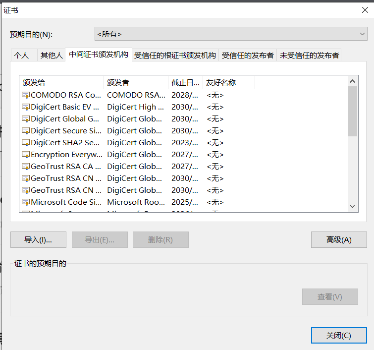

# 中传放心传

本项目是 [中国传媒大学密码学应用实践课程](https://c4pr1c3.github.io/cuc-wiki/ac.html) 的一个样例工程。

## 功能清单

* 基于网页的用户注册与登录系统
  * 使用https绑定证书到域名而非IP地址 【 PKI X.509 】
  * 允许用户注册到系统
    * 用户名的合法字符集范围：中文、英文字母、数字
      * 类似：-、_、.等合法字符集范围之外的字符不允许使用
    * 用户口令长度限制在36个字符之内
    * 对用户输入的口令进行强度校验，禁止使用弱口令
  * 使用合法用户名和口令登录系统
  * 禁止使用明文存储用户口令 
    * 存储的口令即使被公开，也无法还原/解码出原始明文口令
  * 忘记密码
* 基于网页的文件上传加密与数字签名系统
  * 已完成《基于网页的用户注册与登录系统》所有要求
  * 限制文件大小：小于 10MB
  * 限制文件类型：office文档、常见图片类型
  * 匿名用户禁止上传文件
  * 对文件进行对称加密存储到文件系统，禁止明文存储文件
  * 系统对加密后文件进行数字签名    
* 基于网页的加密文件下载与解密
  * 已完成《基于网页的文件上传加密与数字签名系统》所有要求 
  * 提供匿名用户加密后文件和关联的数字签名文件的下载
    * 客户端对下载后的文件进行数字签名验证
    * 客户端对下载后的文件可以解密还原到原始文件
  * 提供已登录用户解密后文件下载
  * 下载URL设置有效期（限制时间和限制下载次数），过期后禁止访问 
  * 提供静态文件的散列值下载，供下载文件完成后本地校验文件完整性

## 本项目用到的关键技术

* 前端使用html、css语言编写，未使用框架
* 后端使用原生 Python 编写，没有使用任何框架
* 程序部署运行环境采用 docker

## 快速上手体验

本样例工程通过 `docker-compose up -d --build` 方式部署后，打开浏览器访问： [http://yxd.cuc.pan:8080](https://yxd.cuc.pan:8080) 即可快速体验系统所有功能。

## 依赖环境安装补充说明

* 确保安装好docker和docker-compose（可利用python的pip命令）

* 配置 `CARoot` 和 `app` 为受信任证书




## 附录-1：项目测试验证环境信息

```
Client: Docker Engine - Community
 Version:           24.0.4
 API version:       1.43
 Go version:        go1.20.5
 Git commit:        3713ee1
 Built:             Fri Jul  7 14:50:55 2023
 OS/Arch:           linux/amd64
 Context:           default

Server: Docker Engine - Community
 Engine:
  Version:          24.0.4
  API version:      1.43 (minimum version 1.12)
  Go version:       go1.20.5
  Git commit:       4ffc614
  Built:            Fri Jul  7 14:50:55 2023
  OS/Arch:          linux/amd64
  Experimental:     false
 containerd:
  Version:          1.6.21
  GitCommit:        3dce8eb055cbb6872793272b4f20ed16117344f8
 runc:
  Version:          1.1.7
  GitCommit:        v1.1.7-0-g860f061
 docker-init:
  Version:          0.19.0
  GitCommit:        de40ad0
```

## 依赖环境安装补充说明

* `build.sh` 的执行需要 `root` 权限，普通用户可以 `sudo bash build.sh` ，建议直接切换到 `root` 用户身份的 `shell` 解释器环境执行 `bash build.sh`
    * 要确保 `docker-compose` 全局安装，可以参考附录里的 `解决 sudo docker-compose 时找不到 docker-compose 的问题`
* 国内特殊网络环境条件下，安装 `docker` 和从 `Docker Hub` 拉取基础镜像可能会无法正常完成，建议使用 **可靠** 镜像源和缓存。推荐：
    * [安装 docker 主程序指南](http://mirrors.ustc.edu.cn/help/docker-ce.html)
    * [加速访问 Docker Hub 指南](http://mirrors.ustc.edu.cn/help/dockerhub.html)

## 演示

[](https://www.bilibili.com/video/BV1Hb4y1R7FE?p=119)


